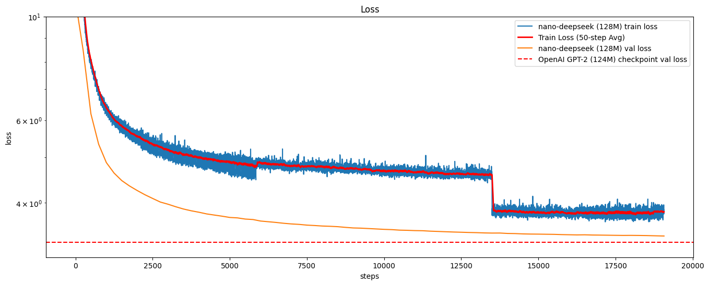

# Nano DeepSeek 🚀

A minimalist project to train a small DeepSeek-style language model (128M parameters) from scratch, inspired by and built upon the foundations of [nanoGPT](https://github.com/karpathy/nanoGPT). It demonstrates core concepts of the DeepSeek-V3 language model.

## Features ✨
- 🧠 128M parameter transformer model (comparable to GPT-2 Small)
- ⚡ Optimized for single-GPU/single-node training
- 📚 Trained on OpenWebText corpus
- 🔥 Modern transformer architecture with:
  - Rotary Position Embedding (RoPE)
  - Muti-Head Latent Attention (MLA)
  - Mix of Experts (MoE)
  - Muti Token Prediction (MTP)

## Model Architecture 📐

| Hyperparameter       | Value    |
|----------------------|----------|
| Layers               | 6       |
| Heads                | 12       |
| Hidden Dimension     | 768      |
| Context Length       | 512     |
| Vocabulary Size      | 50257    |
| Total Parameters     | ~128M    |

the specific hyper-parameters can be found in model.py!

## Training Process 🏋️

### Data Preparation
```bash
python findweb.py
```

### Start Training
```bash
python train_deepseek.py
```

### Sampling
```bash
python inference.py
```

### Evaluation
HellaSwag evaluation script:
```bash
python hellaswag.py
```

## Results 📊

### Training Loss Progress


### Benchmark Comparison
| Model          | Params | Training Loss | HellaSwag (Acc.) |
|----------------|--------|---------------|------------------|
| **Nano DeepSeek** | 128M   | 3.39   | 28.1%     |
| GPT-2          | 117M   | 2.85          | 29.4%           |
| GPT-2 Medium   | 350M   | 2.60          | 37.5%           |
| GPT-3          | 124M   | 1.73          | 33.7%           |

*Benchmark numbers shown for GPT series are reference values from published papers*

## License
This code repository is licensed under the MIT License.

## Citation

This project builds directly upon Andrej Karpathy's nanoGPT:
https://github.com/karpathy/nanoGPT

And the official code: 
https://github.com/deepseek-ai/DeepSeek-V3

## Roadmap 🗺️
- [x] Base architecture implementation
- [ ] Training convergence verification
- [ ] Full benchmark suite
- [ ] SFT and RLHF